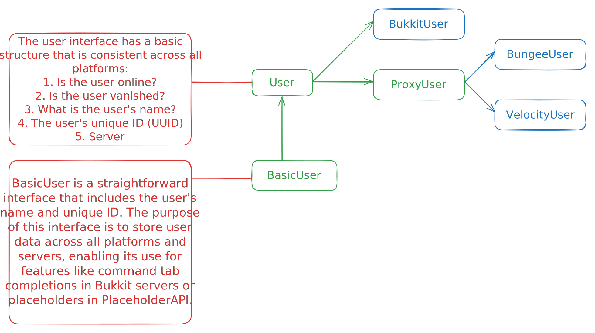

# How It Works?

SayanVanish uses a modular system to operate independently of specific platforms.

### API Module

The `api` module is designed for universal use across all platforms, providing access to necessary data.

#### User Interface

The `User` interface contains all the basic data you might need. It is structured as follows:

### Database

The main `Database` interface includes all common database functions, which are implemented in various database classes such as SQL or Redis. This database is crucial for syncing data between multiple servers and SayanVanish instances across different networks.

#### Database Structure

The database structure is depicted below:

### Features

Features in SayanVanish can be used to implement complex logic with certain constraints:

1. All parameters within a feature must have default values.
2. All parameters should be basic objects like `String`, `Integer`, `Boolean`, etc.

#### Rules for Features

Additionally, adhere to the following rules:

1. Variables that should not be serialized must be annotated with `transient`.

The feature structure is illustrated as follows:

***

For further details and advanced configurations, continue to the next sections.
